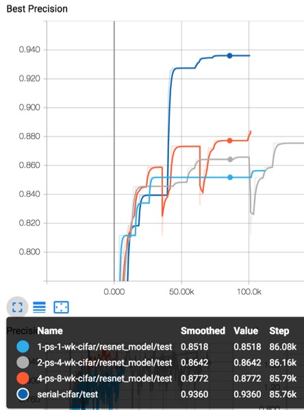

# Distributed ResNet on Cifar and Imagenet Dataset.

This Repo contains code for Distributed ResNet Training and scripts to submit distributed tasks in slurm system, specific to multiple machine each having one GPU card.
I use the [official resnet model](https://github.com/tensorflow/models/tree/master/official/resnet) provided by google and wrap it with my distributed code using [SyncReplicaOptimzor](https://www.tensorflow.org/api_docs/python/tf/train/SyncReplicasOptimizer).
Some modifications from official model in r1.4 are made to fit r1.3 version Tensorflow.

## Problem occured:
I met the same problem with SyncReplicaOptimzor as mentioned in

[github issue](https://github.com/tensorflow/tensorflow/issues/6976)

[stackoverflow](https://stackoverflow.com/questions/42006967/scalability-issues-related-to-distributed-tensorflow)

If you have any idea to fix this problem, please contact the author.
contact: Jiarui Fang (fjr14@mails.tsinghua.edu.cn)

<b>Results with this code:</b>
1. Cifar-10
global batch size = 128, eval results are as following.
Each node is a P100 GPU.

CIFAR-10 Model|Best Precision|PS-WK |Steps|Speed (stp/sec)
--------------|--------------|------|-----|--------------
50 layer|93.6%|local|~80k|13.94
50 layer|85.2%|1ps-1wk|~80k|10.19
50 layer|86.4%|2ps-4wk|~80k|20.3
50 layer|87.3%|4ps-8wk|~60k|19.19

The eval best precisions are illustrated in the following picture. Jumps in curves are due to restart evaluation from checkpoint, which will loss previous best precision values and shows sudden drop of curves in picture.


Distributed Versions get lower eval accuracy results as provided in [Tensorflow Model Research](https://github.com/tensorflow/models/tree/master/research/resnet)

2. ImageNet
We set global batch size as 128\*8 = 1024.
Follows the Hyperparameter settting in [Intel-Caffe](https://github.com/intel/caffe/tree/master/models/intel_optimized_models/multinode/resnet_50_8_nodes), i.e. sub-batch-size is 128 for each node. Runing out of memory warning will occure for 128 sub-batch-size. 

ImageNet Model|Best Precision|PS-WK |Steps|Speed (stp/sec)
--------------|--------------|------|-----|--------------
50 layer|62.6%| 8-ps-8wk| ~76k | 0.93
50 layer|64.4%| 4-ps-8wk| ~75k | 0.90
50 layer|- | 8-ps-128wk | - | 0.285

Also get lower eval accuracy values.

## Usage
<b>Prerequists</b>

1. Install TensorFlow, Bazel.
I install a conda2 package on Daint. Bazel and other packages required are installed by virtualenv inside conda2.

2. Download ImageNet Dataset to Daint
To avoid the error raised from unrecognition of the relative directory path, the following modification should made in download_and_preprocess_imagenet.sh.
replace
```shell
WORK_DIR="$0.runfiles/inception/inception"
```
with
```shell
WORK_DIR="$(realpath -s "$0").runfiles/inception/inception"

```
After few days, you will see the following data in your data path.
Due to the file system of Daint dose not support storage of millions of files, you have to deleted raw-data directory.

3. Download CIFAR-10/CIFAR-100 dataset.
```shell
curl -o cifar-10-binary.tar.gz https://www.cs.toronto.edu/~kriz/cifar-10-binary.tar.gz
curl -o cifar-100-binary.tar.gz https://www.cs.toronto.edu/~kriz/cifar-100-binary.tar.gz
```

<b>How to run:</b>
```shell
$ cd scripts 
# run local for cifar10. It will launch 1 ps and 2 workers
$ sh submit_local_dist.sh
# run distributed for cifar
$ sh submit_cifar_daint_dist.sh #server #worker #batch_size
# run distributed for Imagenet
$ sh submit_imagenet_daint_dist.sh #server #worker
```
I left one node for evaluation, so the #worker should be the #worker for traing plus one.
For example, you would like to launch a 2 ps and 4 worker job and evaluate your model simultanously on another node. 
The ps and work are assigned to the same node in default.
```shell
$ cd scripts
$ sh submit_imagenet_daint_dist.sh 2 5
```

<b>Related papers:</b>

Identity Mappings in Deep Residual Networks

https://arxiv.org/pdf/1603.05027v2.pdf

Deep Residual Learning for Image Recognition

https://arxiv.org/pdf/1512.03385v1.pdf

Wide Residual Networks

https://arxiv.org/pdf/1605.07146v1.pdf


